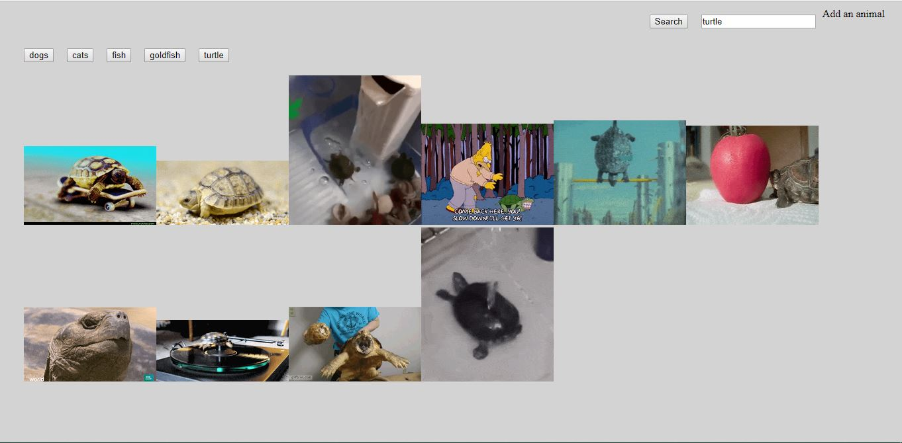

# Giphy

The Giphy is an app that allows through different types of videos of certain contents. In the present app, one can find various videos of almost any animal that they would like to see, with the default animals being dogs, cats, fish and goldfish.

Technologies used to make this app include:

* HTML for styling
* Javascript for processing the app
* Giphy API for the content

Instructions :

Step 1 : When you land on the app page, you will see the default animal buttons and the search bar with the search button.

Step 2 : When you click any one of the buttons, depending on the button, you will see the still images of the giphy. Clicking on them will start the animation.

Step 3 : For animals of your choice, you can type in the animal in the search bar shown below and when you hit search, the button will be added so that you can look at the images of the searched animal. Click the button and you will see the newly added animal!

As you can see in the image below, the new animal that is added is the turtle.

Step 4 : Once you click on the button, the giphys for the added animal will show up.

Bugs and Known Issues to be fixed : 

* Once a default animal button is clicked and you add a new animal after, all the buttons will stop operating and no giphy will show up.

* Clicking on a giphy will only restart the giphy but not stop it from playing as it is supposed to